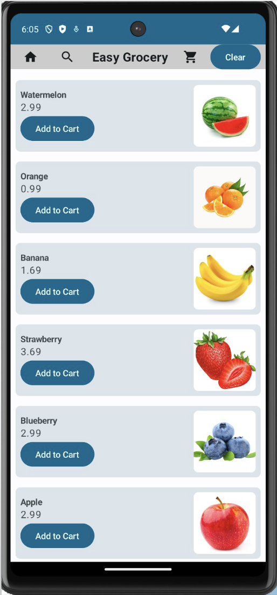
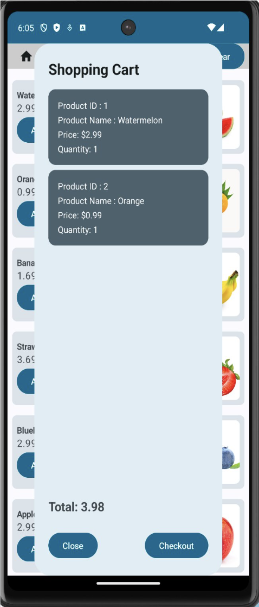
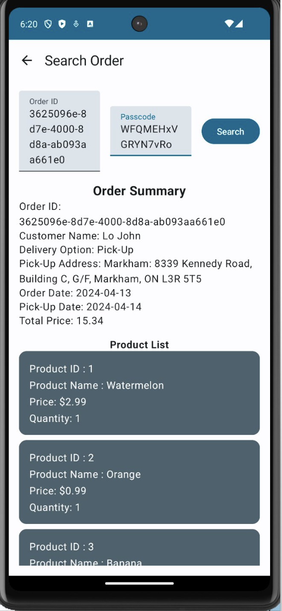
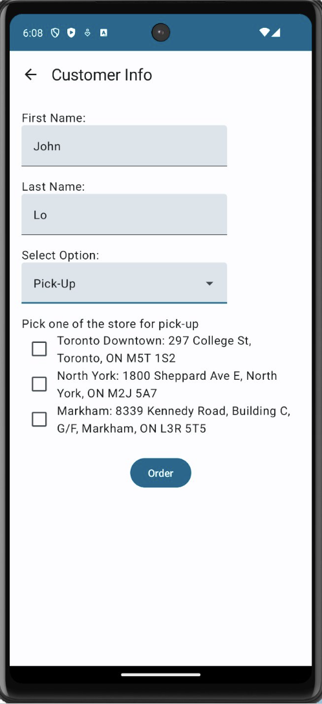
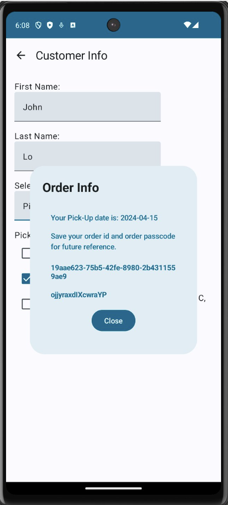

# Easy Grocery​ - An Android App Developed with Kotlin

## Functionality​
Home Screen – Product Browsing Page​
 

 
 
Shopping Cart 
 

 
 
Search Order
 

 
 
Order Function
 

 
 
Order Confirmation
 

 
 